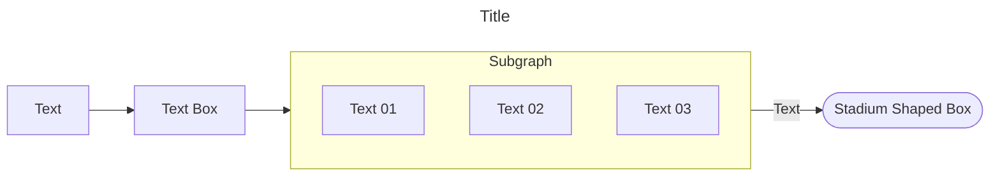

## Markdown Syntax

Markdown is a lightweight markup language that uses simple and easy-to-read text formatting syntax. It's designed to be human-readable and can be converted into HTML or other rich text formats. Markdown is commonly used for writing content for the web, including documentation, note-taking, messaging, and more. First we will discuss some [[#General Markdown Syntax]] and then we will discuss some of [[#Obsidian Specific Markdown Syntax|Obsidian Specific]].

### General Markdown Syntax

**Headers**:

```
# Heading 1
## Heading 2
### Heading 3
#### Heading 4
##### Heading 5
###### Heading 6
```

**Emphasis**:

```
*Italic* or _Italic_
**Bold** or __Bold__
```

**Ordered List**:

```
- Item 1
- Item 2
  - Sub-item 2.1
  - Sub-item 2.2
```

**Unordered List**:

```
1. First item
2. Second item
3. Third item
```


>  Internal Links and Internal Image Embeds will be discussed


**Web Links**: 

```
[Custom Name](WEB URL)
```

**Image Embeds**:

```

```

**Blockquote**

```
> This is a blockquote
```

**Inline Code**:

```
`inline code`
```

**Code Block**:

````
```py
This is a python code block
```

```js
This is a java script code block
```

```html
This is a HTML code block
```

```css
This is a CSS code block
```

```bash
This is a Bash Script code block
```
````

**Horizontal Rule**:

```
---
```

**Tables**:

```
| Header 1 | Header 2 |
| -------- | -------- |
| Content 1| Content 2|
```

**Escaping Characters**:
```
\*literal asterisks\*
```

**HTML CSS Syntax**: 

While some additional syntax don't exist in markdown such as aligning text, you can use `html` and `css` to meet some of your basic needs such as alignment, breaks and spaces.


```html
<!-- Here the word Text is aligned at center -->
<p style=text-align:center>Text</p>

<!-- Here the word Text is aligned at left -->
<p style=text-align:left>Text</p>

<!-- Here the word Text is aligned at right -->
<p style=text-align:right>Text</p>

<!-- In markdown, multiple spaces don't work -->
<!-- Use `&nbsp;` (Non Breakable Space) element -->
Hi &nbsp;&nbsp;&nbsp;&nbsp;&nbsp;I am after some Space

<!-- In markdown, multiple `enter` don't work -->
<!-- Use `<br>` (Break) element for multiple lines -->
Hi<br><br><br>I am here after some lines

<!-- In markdown, you can't colour the text -->
<!-- Use CSS to style the Text; here the text is red -->
<p style=color:red>Text</p>
```


### Obsidian Specific Markdown Syntax

**Internal Links and Embeds**

> - Note: You can use [Keyboard Shortcuts for Editing](https://help.obsidian.md/Editing+and+formatting/Keyboard+shortcuts+for+editing)
> - You can go through the documentation for [Basic Formatting Syntax](https://help.obsidian.md/Editing+and+formatting/Basic+formatting+syntax#Code+blocks)
> - Anyway I will include some here that are not available there or if I have a better way in explaining it.
> - We already discussed earlier on external links and external image embeds.
> - The only difference between links and embeds is embeds are followed by a`!`.
> - You can ignore `alias` or `alt text` or `custom name` and `image size` if not required.

| | |
-|-
Link to File | `[[File Name OR File Path]]` | `[[File Name or File Path\|Alias]]`
Link to Heading | `[[File Name OR File Path#HEADING]]`
Link to a Block | `[[File Name OR File Path^BLOCK-ID]]`

> - Aliases are used to rename the link from its Original Name. Example: `[[Link|Alias]]`.
> - You can embed any of the above links like this `![[Link]]`.
> - If you want to link to a heading or block within the current page. Use `![[#]]` & `![[^]]`.
> - Once you type in `#` you will get a popup to choose from available headings to link and `^` for blocks.
> - You can link to or embed images, videos and documents using relevant links
> - Check [Highlights](https://help.obsidian.md/Editing+and+formatting/Basic+formatting+syntax#Bold%2C+italics%2C+highlights), [Task Lists](https://help.obsidian.md/Editing+and+formatting/Basic+formatting+syntax#Task+lists), [Footnotes](https://help.obsidian.md/Editing+and+formatting/Basic+formatting+syntax#Footnotes) and also don't miss [Callouts](https://help.obsidian.md/Editing+and+formatting/Callouts) and [YouTube Embeds](https://help.obsidian.md/Editing+and+formatting/Embedding+web+pages#Embed+a+YouTube+video)

**Diagrams in your Notes**

You can add diagrams such as [flow charts](https://mermaid.js.org/syntax/flowchart.html), [sequence diagrams](https://mermaid.js.org/syntax/sequenceDiagram.html), and [timelines](https://mermaid.js.org/syntax/timeline.html). to your notes, using [Mermaid](https://mermaid-js.github.io/).
I have used mermaid only for flowcharts; here I will share an example flowcharts in obsidian.

````

````

> - The above mermaid code snippet will generate the below diagram
> 
> 
> - Here the `title` is not required and in the subgraph `direction TB` unless if you want to change.
> - While the term `flowchart` is mandatory `LR` is not unless if you want to change the default.
> - There are a lot more options and styles in formatting flowcharts. Refer documentations.
> 
> Possible Flowchart Orientations:
> 
> | | |
> --|--
> TB | Top to Bottom
> BT | Bottom to Top
> RL | Right to Left
> LR | Left to Right

**Mathematics and Equations**

You can add math expressions to your notes using [MathJax](http://docs.mathjax.org/en/latest/basic/mathjax.html) and the LaTeX notation. Example ⬇️

```mathJax
$\text{Text Here} = 2 + {\frac{3}{\text{Text Here}}} - 5 * 100 / 6$
$$\text{Text Here} = 2 + {\frac{3}{\text{Text Here}}} - 5 * 100 / 6$$
```

> - This is a result of the above Syntaxes for further assistance refer the Documentation.
> 
> 
